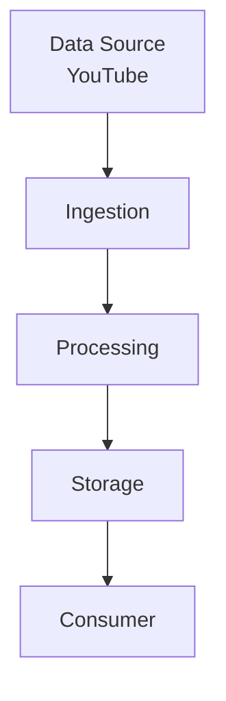
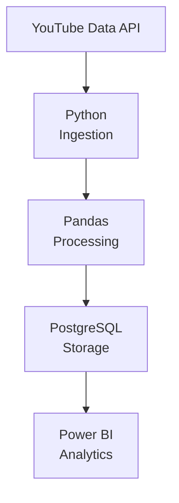

## 1. Selected Data Source

### YouTube

**Source:** YouTube Data API

**Objective:**

The objective is to collect video and engagement data from YouTube and use it for processing, storage, and visualization.

### Data Collected

- Video ID
- Video Title
- Channel Name
- Category
- Published Date
- Views
- Likes
- Comments

### 2. Pipeline Overview

YouTube
↓
Ingestion
↓
Processing
↓
Storage
↓
Dashboard / Analytics

The pipeline collects data from YouTube, process the collected data, store the cleaned data and finally makes it available for analytics and visualization.

### **3. Logical Architecture**

### **4. Technology Mapping**

### 5. Component Explanation

| Component | Purpose |
| :--- | :--- |
| YouTube Data API | To obtain data from YouTube |
| Python | To collect data from API |
| Pandas | To clean and transform data |
| PostgreSQL | To store processed data |
| Power BI | To visualize data through dashboards and reports |

### 6. Data Flow Explanation

### YouTube → Python

Python YouTube API help to collects required data.

### Python → Pandas

Collected raw data are use  to clean and transform the data.

### Pandas → PostgreSQL

Cleaned data is being stored into structured database.

### PostgreSQL → Power BI

Power BI use stored data to create dashboard and reports.

## 7. Question Log

> Why use PostgreSQL instead of a CSV file?

> Why do we need a processing stage?

> Why can't the dashboard directly read data from YouTube API?

## 8. Architecture Decision

### Why did I choose this architecture?

> I selected a simple batch-based architecture because the objective is to collect and analyze YouTube data rather than provide real-time results. The architecture contains only the components required for data collection, processing, storage and visualization. Technologies such as Kafka, Spark and Airflow were not included because they are not necessary for this simple use case.

### **9. Short Architecture Explanation**

> YouTube is the data source. Python collects the data through the YouTube Data API. Pandas processes and cleans the data. PostgreSQL stores the processed data, and Power BI uses the stored data for analytics and visualization.

### 10. Conclusion

This pipeline demonstrates how data moves from a real-world source to a final consumer. The architecture follows the basic flow of Source → Ingestion → Processing → Storage → Consumer. The design is intentionally simple so that every component has a clear purpose.

### 11. References

- Google Cloud — Data Pipeline Architecture
- YouTube Data API Documentation
- PostgreSQL Documentation
- Microsoft Power BI Documentation

* *

-by Vinayak Bhardwaj

